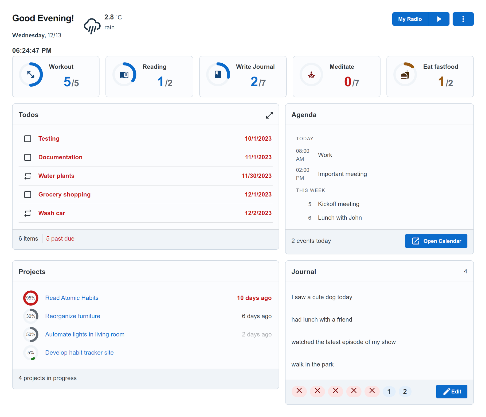

# Atomic Tracker


A self-hosted habit tracking web application with a personal dashboard and optional integrations to external data providers.

<p align="center">

</p>

### Why?

I personally find it useful to have a graphical overview of the things I'm working on, the progress I've made, my agenda for the upcoming days and so on.

**Why Atomic?** the term comes from the _#1 New York Times bestseller_ [Atomic Habits](https://jamesclear.com/atomic-habits) by James Clear. The dashboard makes the habits and their consistency visible, helps you break them into small actions that are easy to do. There is also a gamification aspect, _small and easy_ actions yield less points than _big_ actions. These points are tracked against your weekly (or any other periodical) targets.

## Installation

Pull the container from GitHub Packages:

```sh
docker pull ghcr.io/majorpeter/atomic-tracker:latest
```

Or clone the repository and build the container locally:

```sh
docker build -t atomic-tracker .
```

Run locally:

```sh
# for GitHub build
docker run --rm --name my-atomic-tracker -p 8080:8080 -v ./config:/config ghcr.io/majorpeter/atomic-tracker:latest

# for local build
docker run --rm --name my-atomic-tracker -p 8080:8080 -v ./config:/config atomic-tracker:latest
```

Open `http://localhost:8080/` in a browser and create your user account. (Only one supported for now.)

## Integrations

### Authentication

#### Google OAuth2

This requires OAuth 2.0 credentials from Google, which can be obtained by [setting up](https://developers.google.com/identity/protocols/oauth2/openid-connect#appsetup) a project in [Google API console](https://console.developers.google.com/apis/).

The redirect URI of the OAuth client should be set to `<app-base-url>/oauth2/redirect/google`, e.g. `https://example.com/oauth2/redirect/google`.

Once credentials have been obtained, pass the following environment variables, by e.g. creating a `.env` file:

```
GOOGLE_CLIENT_ID=__INSERT_CLIENT_ID_HERE__
GOOGLE_CLIENT_SECRET=__INSERT_CLIENT_SECRET_HERE__
GOOGLE_OAUTH_CALLBACK_URL=https://<app-base-url>/oauth2/redirect/google
```

The last one is required if the application is running behind a proxy (which should be the case since HTTPS should be used).

### Dashboard content

- **Nextcloud Tasks:** Todos block can read from a Nextcloud instance
- **Google Calendar:** Agenda block can fetch events from Google Calendar
- **Redmine:** Projects block can read issues in progress from a Redmine instance

## Environment Variables

- `CONFIG_DIR`: where to put database file (SQLite)
- `LISTENING_PORT`: web server listens on this port (`8080` by default)
- `BYPASS_LOGIN`: debug option to treat client as user #1 without logging in (useful when backend is restarted on each code change)
- `USE_DUMMY_DATA`: debug option to output dummy data instead of fetching from integrations (useful for screenshots)

## Development

Both the backend and the frontend have development server setups. Run the following commands in 2 separate shells:

```sh
(cd backend/ && BYPASS_LOGIN=1 npm run dev)
```

```sh
(cd frontend/ && npm run dev)
```

### DB seeding

Once the database is created, it can be populated via the seeders:

```sh
(cd backend/ && npm run seed)
```

This creates an `admin` account with empty password.

### Adding migrations

Migrations are in `backend/migrations/`, use the following command and follow the naming scheme used before:

```sh
npx sequelize-cli migration:create --migrations-path src/migrations/ --name <name>
```

Or just copy from an existing file. Make sure to shut down backend development server before editing migrations since they are applied automatically.

### Adding translations (i18n)

Use new keys in `<Trans>` and `useTranslation`. Then call the following to add missing keys to translation files:

```sh
(cd frontend/ && npm run i18n)
```


